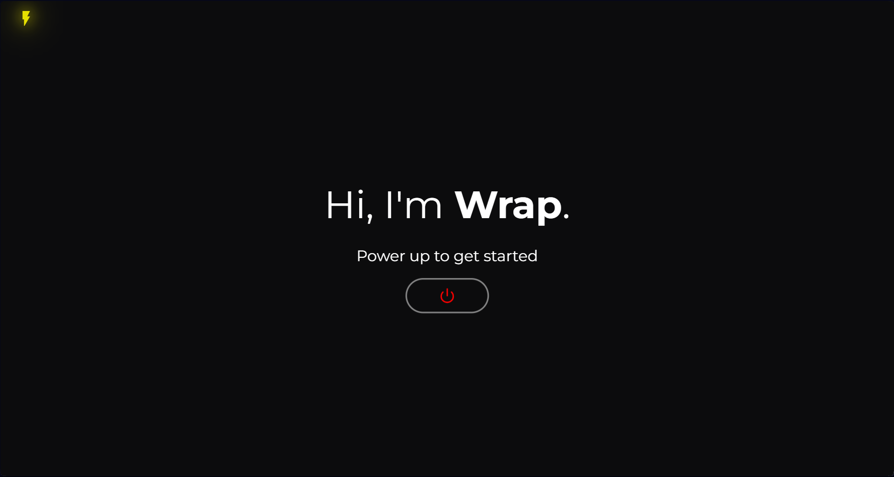
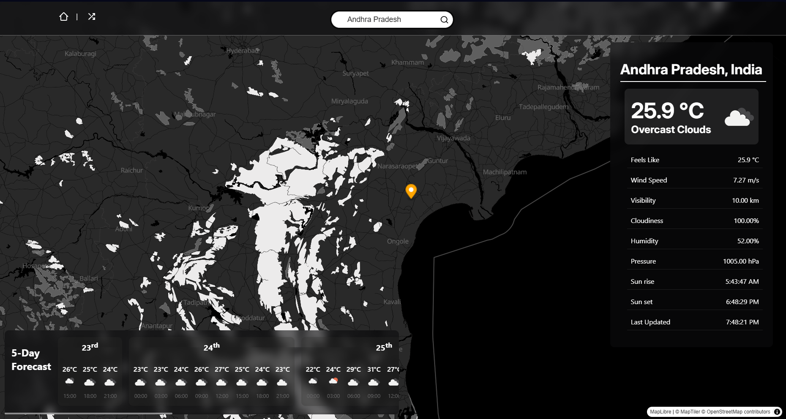
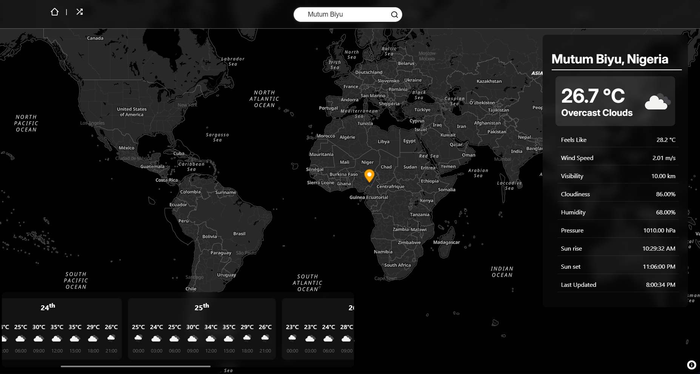
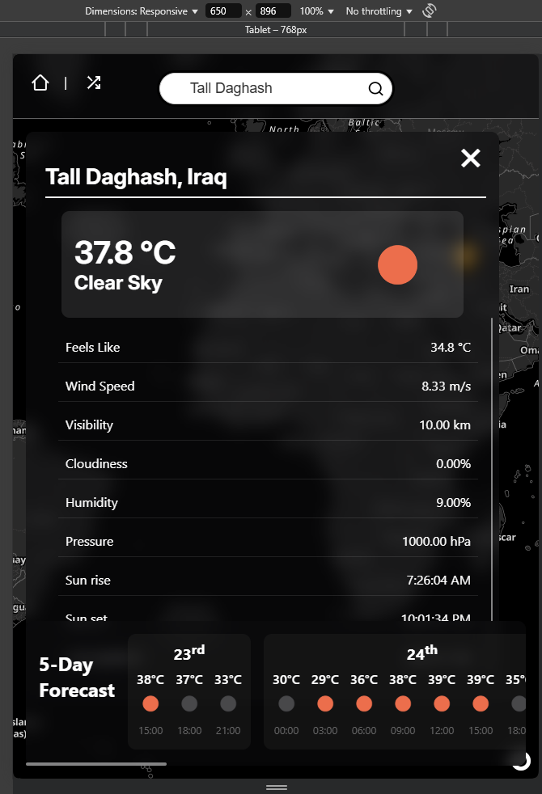
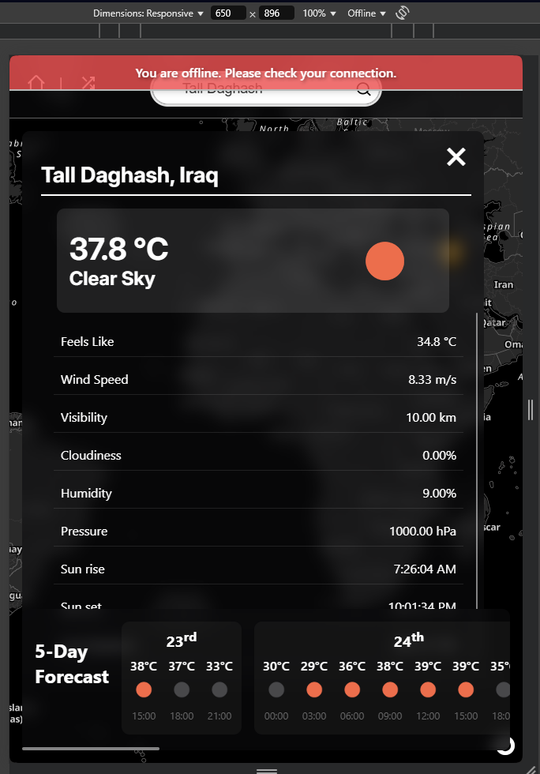
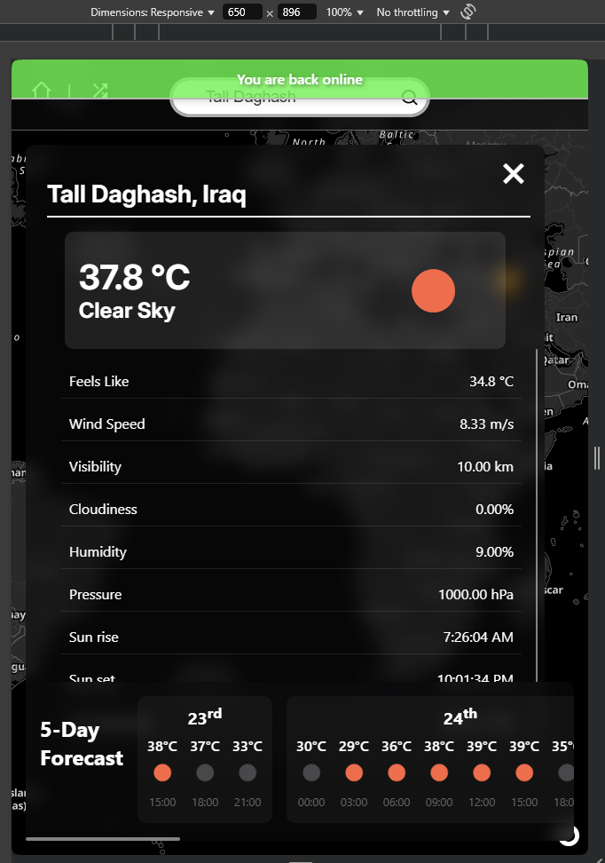

# 🌦️ Wrap - Interactive Weather Dashboard

**Wrap** is a beautiful, real-time, interactive weather dashboard built with **React**, **MapLibre GL JS**, and the **OpenWeatherMap API**. It provides current weather data, 5-day forecasts, location-based search, map interactions, and network awareness — all in a responsive and user-friendly UI.



---
## ✨ Features

* 🔍 **Smart City Search**
  Instantly search any city worldwide to view current weather conditions and a 5-day hourly forecast.

* 🌍 **Interactive Map Click**
  Click anywhere on the global map to fetch localized weather data for that precise location — no typing needed.

* 📍 **Auto-Detect Location**
  Get weather details for your current location using browser geolocation (with user permission).

* 📅 **5-Day Forecast Visualization**
  See upcoming weather trends grouped by date with hourly breakdowns, temperature, and condition icons.

* 🧠 **Recent City History**
  Automatically remembers your last 5 searched cities using `localStorage` — quick access without typing again.

* 🌙 **Dark Mode Friendly**
  Supports a dark theme out of the box for better readability in low-light environments.

* 📶 **Real-Time Network Detection**
  Detects and notifies you when you go offline or come back online — perfect for unstable connections.

* 📱 **Fully Responsive UI**
  Built with a mobile-first approach — works seamlessly across desktops, tablets, and smartphones.

---

## 🧱 Built With

| Tech        | Description                         |
|-------------|-------------------------------------|
| React       | Frontend Framework                  |
| MapLibre GL | Open-source mapping library         |
| OpenWeatherMap API | Weather data (Current + Forecast) |
| OpenCage API       | Geocoding (City to Lat/Lng)   |
| CSS         | Custom styles, transitions, layout  |

[![React][React.js]][React-url]
[![MapLibre GL JS][MapLibre]][MapLibre-url]
[![OpenWeatherMap][OpenWeather]][OpenWeather-url]
[![OpenCage][OpenCage]][OpenCage-url]
[![JavaScript][JavaScript]][JavaScript-url]
[![CSS3][CSS3]][CSS3-url]
[![Vite][Vite]][Vite-url]

---

## 📸 Screenshots

### 🔍 City Search (Andhra Pradesh, India)


### 🌍 Global Map Click (Mutum Biyu, Nigeria)


### 📱 Responsive Mode (Tall Daghash, Iraq)


### 🚫 Offline Mode


### ✅ Back Online


---

## 🚀 Getting Started

### 1. Clone the Repository

```bash
git clone https://github.com/Bookinheaven/Wrap.git
cd Wrap
````

### 2. Install Dependencies

```bash
npm install
```

### 3. Setup Environment Variables

Create a `.env` file in the root directory with the following keys:

```env
VITE_WEATHER_API_KEY=your_openweathermap_api_key
VITE_WEATHER_GEOCAGE_KEY=your_opencage_api_key
```

### 4. Run the App

```bash
npm run dev
```

Your app will be available at `http://localhost:5173`.


---

## 📌 To-Do & Enhancements

* [ ] Toggle °C / °F support
* [ ] Add weather icon animations
* [ ] Show weather cards for recent cities
* [ ] Unit tests for utility functions
* [ ] Light/Dark mode toggle UI

---

## 🌐 APIs Used

* [OpenWeatherMap](https://openweathermap.org/api)
* [OpenCage Geocoding](https://opencagedata.com/api)
* [MapLibre GL JS](https://maplibre.org/)

---

## 💬 Feedback or Contributions?

Feel free to open issues or pull requests if you’d like to contribute, report bugs, or suggest improvements.

---
<!-- Badges -->
[React.js]: https://img.shields.io/badge/React-20232A?style=for-the-badge&logo=react&logoColor=61DAFB
[React-url]: https://reactjs.org/

[MapLibre]: https://img.shields.io/badge/MapLibre-0E1117?style=for-the-badge&logo=mapbox&logoColor=00BFFF
[MapLibre-url]: https://maplibre.org/

[OpenWeather]: https://img.shields.io/badge/OpenWeatherMap-FF6B00?style=for-the-badge&logo=openweathermap&logoColor=white
[OpenWeather-url]: https://openweathermap.org/

[OpenCage]: https://img.shields.io/badge/OpenCage-Geocoder-0066CC?style=for-the-badge&logo=mapbox&logoColor=white
[OpenCage-url]: https://opencagedata.com/

[JavaScript]: https://img.shields.io/badge/JavaScript-F7DF1E?style=for-the-badge&logo=javascript&logoColor=black
[JavaScript-url]: https://developer.mozilla.org/en-US/docs/Web/JavaScript

[CSS3]: https://img.shields.io/badge/CSS3-1572B6?style=for-the-badge&logo=css3&logoColor=white
[CSS3-url]: https://developer.mozilla.org/en-US/docs/Web/CSS

[Vite]: https://img.shields.io/badge/Vite-646CFF?style=for-the-badge&logo=vite&logoColor=white
[Vite-url]: https://vitejs.dev/
